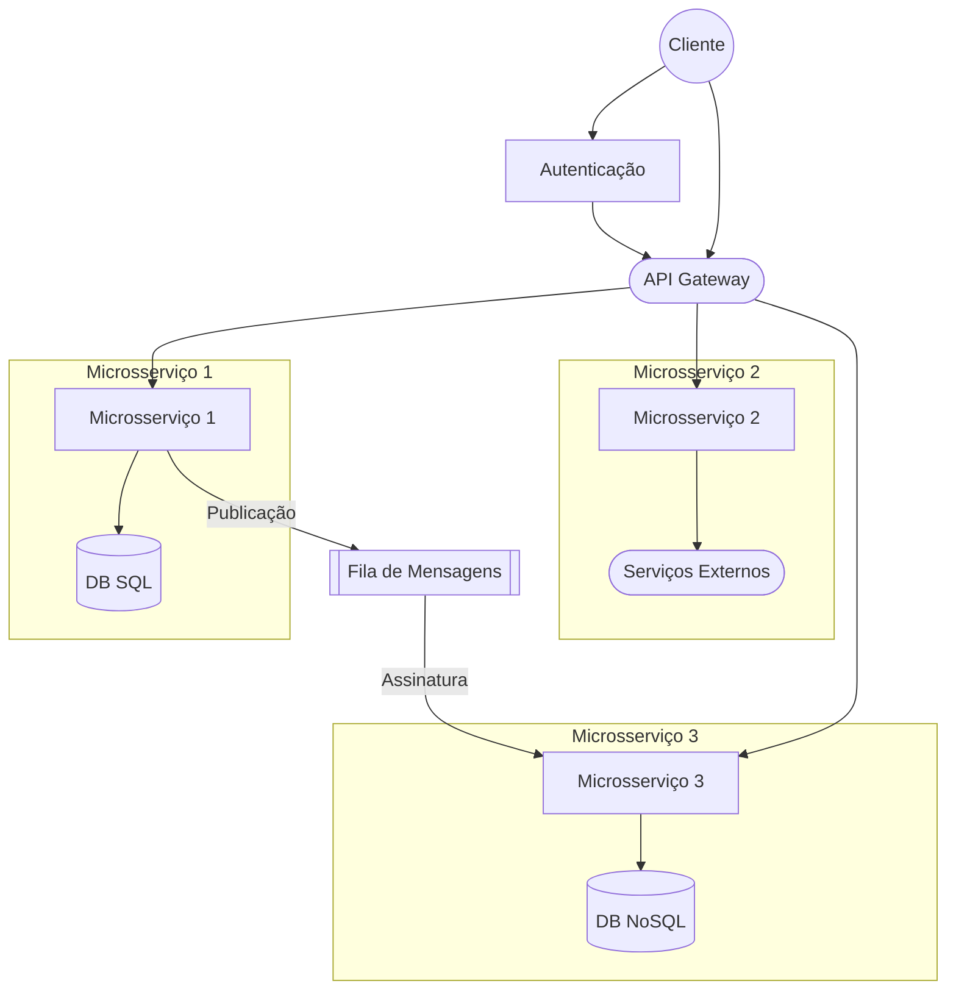

# Sobre Microsserviços

Microsserviços são uma abordagem arquitetural em que uma aplicação é dividida em componentes independentes e autônomos. Cada microsserviço representa uma funcionalidade específica e pode ser desenvolvido, implantado e dimensionado de forma independente dos demais. Essa arquitetura favorece a escalabilidade, a manutenção e a evolução contínua do sistema como um todo.

Os microsserviços são organizados em torno de recursos de negócio e são responsáveis por oferecer APIs (Interfaces de Programação de Aplicações) para que outros microsserviços ou componentes externos possam interagir com eles. Eles geralmente se comunicam por meio de mecanismos de comunicação como:

 - HTTP/REST;
 - Mensageria assíncrona ;
 - Chamadas de procedimento remoto (RPC).

# Diagrama

Aqui está um exemplo de diagrama representando uma arquitetura de microsserviços:

